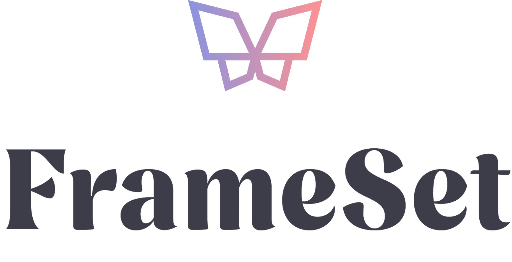

<div align="center">
	<picture>
		<source media="(prefers-color-scheme: dark)" srcset="frontend/public/FrameSet_Logo_Reversed.png">
		
	</picture>
	<p><b>FRAMESET — The graphic reference, built for digital illustration.</b></p>
	<p>
		<a href="https://github.com/AxelleDev/FrameSet/actions/workflows/ci.yml">
			
		</a>
	</p>
</div>

---

## ✧･ﾟ: ✧･ﾟ About the project

FrameSet is a full-stack web app for illustrators and digital creators. It lets you
**centralise, structure and export** the graphic references of an illustration project —
colour palettes, typographies and brush specs — so you keep a consistent visual identity
from one drawing to the next.

---

## ✧･ﾟ: ✧･ﾟ Features

- **Accounts & authentication** — sign up, log in (email/password or "Continue
  with Google"), e-mail verification and profile management (JWT, hashed
  passwords, CSRF protection & rate-limiting). Optional **two-factor
  authentication (TOTP)** — enable it from your profile with any authenticator
  app (Google Authenticator, Authy, 1Password…) via QR code or manual entry,
  with one-time recovery codes for when you lose access to it. A "Try the
  demo" button signs visitors straight into a shared, read-only account
  seeded with real project data — content edits feel fully interactive but
  are simulated client-side and never reach the database; every mutating
  request is also rejected server-side regardless, as a second, independent
  guarantee.
- **Projects** — a dashboard to create, duplicate and manage multiple illustration
  projects (duplication copies the standards and palette, to reuse a setup as a base).
  Pin projects to keep them at the top, search by name once you have several, and
  reorder pinned projects by drag-and-drop. A global **Ctrl+K search** jumps to any
  project, palette colour (by name or hex) or standard from anywhere in the app.
  Deleted projects (and individual colors and standards) go to a trash and stay
  restorable for 30 days before being purged.
- **Palettes** — colour management with drag-and-drop reordering. Build a palette
  by hand, extract it from an image, **generate harmonies** (complementary,
  analogous, triad) from any base colour, or **import an existing palette file**
  (Adobe `.ase`, Krita/GIMP `.gpl`, Procreate `.swatches` — parsed client-side,
  drag-and-drop the file anywhere on the page). View the whole palette — and copy
  any colour in one click — as **HEX, RGB, HSL or HSB** (the values Procreate's
  sliders expose).
- **Specs** — typographies (searchable Google Fonts picker) and brushes (size,
  opacity, usage…), also drag-and-drop reorderable.
- **Export & share** — generate a PDF of the project's complete reference
  sheet, download the palette in your drawing app's native format (Adobe
  `.ase` — also Clip Studio Paint's own color-set import format —, Krita/GIMP
  `.gpl`, Procreate `.swatches` — all generated client-side, no dependency,
  and re-importable the same way), or share a public read-only link
  (revocable anytime) that anyone can open without an account.
- **Accessible & resilient** — keyboard-operable throughout (including drag-and-drop,
  which always has a keyboard alternative), a warning before leaving a page with
  unsaved changes, a heads-up before your session expires, and clear rate-limit
  feedback with a live countdown instead of a static "try again later".
- **Installable app (PWA)** — install FrameSet from the browser on desktop,
  iPad or phone and launch it like a native app. A service worker pre-caches
  the app shell and fonts for instant startup, and new versions are picked up
  automatically on the next visit.

---

## ✧･ﾟ: ✧･ﾟ Tech stack

**Frontend** — React 18, Vite, React Router, Tailwind CSS, react-select, jsPDF, vite-plugin-pwa
**Backend** — Node.js, Express, MySQL, JWT, bcrypt, Helmet, Nodemailer
**Quality** — Vitest (front), Jest + Supertest (back), GitHub Actions CI

---

## ✧･ﾟ: ✧･ﾟ Project structure

```
frameset/
├── backend/            # Node.js API (Express + MySQL)
│   ├── API.md          # REST API reference (endpoints, auth, errors)
│   ├── migrations/     # Versioned SQL scripts
│   ├── src/            # Routes, controllers, services, middlewares
│   └── tests/          # Unit & integration tests
└── frontend/           # React application
    └── src/            # Pages, components, contexts, hooks
```

The full REST API (endpoints, authentication, CSRF, error conventions) is
documented in [backend/API.md](backend/API.md).

---

## ✧･ﾟ: ✧･ﾟ Getting started

### Prerequisites

- **Node.js ≥ 20** (Node 22 recommended — see `.nvmrc`, the version CI runs) and **npm**
- **MySQL 8** or **MariaDB** — your own install, or the bundled dev database:
  `docker compose up -d` (starts MySQL and creates `frameset_db` for you)

### Backend (API)

```bash
cd backend
npm install
cp .env.example .env   # configure the DB, JWT and mail settings

# Create the database first (skip this if you used `docker compose up -d`):
#   mysql -u root -p -e "CREATE DATABASE frameset_db CHARACTER SET utf8mb4 COLLATE utf8mb4_unicode_ci;"

npm run migrate        # create the tables
npm start              # API on http://localhost:3000
```

Interactive API docs (Swagger UI) are served at `/api-docs`, with a health probe
at `/health`. The docs are on by default in development; in production they are
opt-in — set `ENABLE_API_DOCS=true` to expose them.

### Frontend (app)

```bash
cd frontend
npm install
cp .env.example .env
npm run dev            # app on http://localhost:5173
```

> From the repo root, convenience scripts proxy to each package:
> `npm run dev:backend`, `npm run dev:frontend`, `npm run migrate:backend`,
> `npm run test:backend`, `npm run test:frontend`, `npm run test:e2e`,
> `npm run build:frontend`.

### End-to-end tests (Playwright)

`e2e/` runs real user journeys — the critical path (register, verify by
email, create a project, add content, share it publicly, export a PDF,
delete the account), password reset, project trash/restore, and
drag-and-drop palette reordering — against a real browser, backend and
database. One-time setup:

```bash
cd e2e
npm install
npx playwright install chromium
```

Then, with your backend's `.env` configured (database + a real or Ethereal
mail setup) and MySQL running:

```bash
npm run test:e2e   # from the repo root
```

This starts its own backend and frontend instances on dedicated ports (3100 /
5273 — never your normal dev servers on 3000 / 5173), against the same dev
database. The backend runs with `E2E_TEST_MODE=true`, which captures outgoing
emails in memory instead of sending them (so the test can read the
verification code) and raises rate limits so repeated local runs don't get
throttled; this flag is inert whenever `NODE_ENV=production`. See
`e2e/tests/` and `backend/src/utils/testMode.js`.

---

## ✧･ﾟ: ✧･ﾟ CI (GitHub Actions)

On every push / pull request to `main`, GitHub Actions runs three jobs:

- **Backend** — a production dependency audit (`npm audit`, high severity),
  linting, formatting (Prettier, check-only) and the test suite.
- **Frontend** — the same audit/lint/format checks, the test suite, and the
  production build.
- **End-to-end** — spins up a MySQL service container, runs the migrations,
  then runs the full Playwright suite (`e2e/`) against real backend and
  frontend instances in `E2E_TEST_MODE`.

Workflow: `.github/workflows/ci.yml`. Dependency updates are proposed monthly by
Dependabot (`.github/dependabot.yml`).

> **Known advisory (accepted, not applicable):** `npm audit` flags
> `react-router-dom` with GHSA-qwww-vcr4-c8h2, a CSRF bypass in React Router's
> **RSC/framework mode**. FrameSet uses the classic `BrowserRouter` SPA mode with
> no React Server Components and no server actions, so the vulnerable code path
> is never reached. The proposed "fix" is a downgrade; instead, the frontend CI
> audit gate is temporarily relaxed to `critical` (see the comment in `ci.yml`)
> and will be restored to `high` as soon as a patched release ships.

---

## ✧･ﾟ: ✧･ﾟ Deployment

The two halves deploy independently — the API does **not** serve the frontend build:

- **Frontend** — a static SPA (`frontend/`), built with `npm run build`. SPA
  fallback + security headers/CSP are configured for Vercel
  ([`frontend/vercel.json`](frontend/vercel.json)); Netlify equivalents
  ([`frontend/public/_redirects`](frontend/public/_redirects) and
  [`frontend/public/_headers`](frontend/public/_headers)) are also provided —
  keep the ones matching your host.
- **Backend** — the Express API (`backend/`) runs as a plain Node service behind a
  reverse proxy that terminates HTTPS.

Production checklist:

- Set **`NODE_ENV=production`** on the API (enables secure cookies, HSTS, JSON
  logs, and makes an email-delivery config mandatory).
- **Email delivery**: configure one path. On hosts that block outbound SMTP
  (Railway, Render, Fly, …) SMTP will silently hang, so use the **Brevo HTTP
  API**: set `BREVO_API_KEY` (a Brevo v3 API key) and `MAIL_FROM_ADDRESS` (an
  address validated as a sender in Brevo). Where SMTP is open, the classic
  `MAIL_HOST/PORT/SECURE/USER/PASS` still works. In production the app refuses to
  boot unless one of the two is fully configured.
- The API trusts **one** reverse-proxy hop by default (`trust proxy = 1`) so
  per-IP rate limiting stays per-client. If the chain is deeper — e.g. the
  frontend host proxies `/api` to the platform edge in front of the API — set
  `TRUST_PROXY_HOPS` to the real number of hops.
- **Cross-domain cookies**: auth cookies are `HttpOnly` + `SameSite`. If the app
  and API are on different domains, set `FRONTEND_ORIGIN` (API) and
  `VITE_API_URL` (frontend) to the real HTTPS origins.
- Point the frontend CSP `connect-src` (in `vercel.json`) at the real API origin.
- Restrict the `GOOGLE_FONTS_API_KEY` in the Google console; `/api-docs` stays
  hidden in production unless you opt in with `ENABLE_API_DOCS=true`.
- **Google sign-in (optional)**: create an OAuth 2.0 **Web** client ID in the
  Google Cloud console (APIs & Services → Credentials) with your frontend origin
  under "Authorized JavaScript origins", then set the same value as
  `GOOGLE_CLIENT_ID` (API) and `VITE_GOOGLE_CLIENT_ID` (frontend). Leave both
  empty to disable the feature (the button is hidden and the endpoint answers 503).
- Rate limiting is **in-memory (per instance)**: run a single API instance, or
  move to a shared store (e.g. Redis) before scaling horizontally.
- Run `npm run migrate` against the production database.
- **Monitoring (optional but recommended)**: set `SENTRY_DSN` (API) and
  `VITE_SENTRY_DSN` (frontend, at build time) to a sentry.io project DSN to
  report every 5xx, crash and caught render error. Both are no-ops when unset.
- **Uptime check**: set the `HEALTH_CHECK_URL` repository variable (Settings →
  Secrets and variables → Actions → Variables) to your deployed
  `https://…/health` URL; `.github/workflows/uptime.yml` then probes it every
  15 minutes and a failure triggers GitHub's notification email. For serious
  alerting, point a dedicated uptime service at the same URL.

### Backups & restore

`npm run backup` (from `backend/`, or `npm run backup:backend` at the root)
dumps the database to a gzipped SQL file in `backend/backups/` (override with
`BACKUP_DIR`) using `mysqldump` — required on `PATH` — and prunes dumps older
than `BACKUP_RETENTION_DAYS` (default 14). The dump is consistent
(`--single-transaction`) and never locks the live API.

- **Schedule it** before onboarding real users — e.g. a daily cron on the API
  host: `0 4 * * * cd /srv/frameset/backend && npm run backup`. Store copies
  off-host (object storage, or your DB host's managed backups if available).
- **Restore**: `gunzip < frameset_db-<timestamp>.sql.gz | mysql -u <user> -p frameset_db`
- **Migration rollback**: migrations are forward-only; the rollback path is
  restoring the latest pre-migration backup (take one right before
  `npm run migrate` on production).

> Not yet provided (add when the hosting target is chosen): a continuous
> deployment workflow and a backend Dockerfile.

---

## ✧･ﾟ: ✧･ﾟ License

Proprietary — © 2026 Axelle Tempier. All rights reserved. This repository is
public for portfolio purposes only; see [LICENSE](LICENSE). No reuse or
distribution without written consent.

---

## ✧･ﾟ: ✧･ﾟ Contact

Made by Axelle — **axelle.tempier@gmail.com**.
