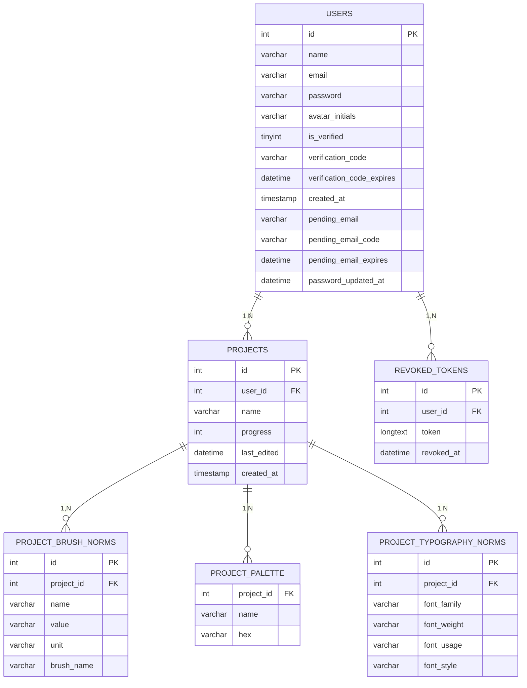

# Diagramme Entité-Relation (ERD) — frameset_db

Copiez ce bloc sur https://mermaid.live pour visualiser le schéma :

```mermaid
erDiagram
    USERS {
      int id PK
      varchar name
      varchar email
      varchar password
      varchar avatar_initials
      tinyint is_verified
      varchar verification_code
      datetime verification_code_expires
      timestamp created_at
      varchar pending_email
      varchar pending_email_code
      datetime pending_email_expires
      datetime password_updated_at
    }
    PROJECTS {
      int id PK
      int user_id FK
      varchar name
      int progress
      datetime last_edited
      timestamp created_at
    }
    PROJECT_BRUSH_NORMS {
      int id PK
      int project_id FK
      varchar name
      varchar value
      varchar unit
      varchar brush_name
    }
    PROJECT_PALETTE {
      int project_id FK
      varchar name
      varchar hex
    }
    PROJECT_TYPOGRAPHY_NORMS {
      int id PK
      int project_id FK
      varchar font_family
      varchar font_weight
      varchar font_usage
      varchar font_style
    }
    REVOKED_TOKENS {
      int id PK
      int user_id FK
      longtext token
      datetime revoked_at
    }

    USERS ||--o{ PROJECTS : "1,N"
    PROJECTS ||--o{ PROJECT_BRUSH_NORMS : "1,N"
    PROJECTS ||--o{ PROJECT_PALETTE : "1,N"
    PROJECTS ||--o{ PROJECT_TYPOGRAPHY_NORMS : "1,N"
    USERS ||--o{ REVOKED_TOKENS : "1,N"
```